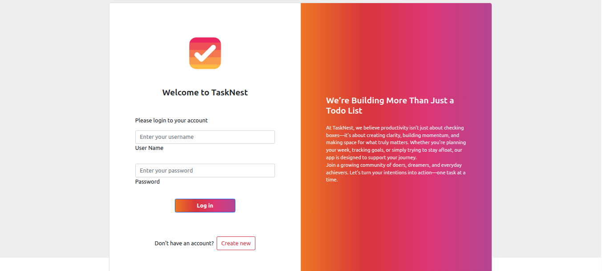

# 📝 TaskNest



TaskNest is a Django-based ToDo application that allows users to:

- ✅ Register and log in securely
- 🗓️ Create tasks with status and due date
- 🔍 Filter tasks based on status or date
- 👤 Manage tasks individually per user

---

## ⚙️ Setup Instructions

Follow these steps to get TaskNest running locally:

### 1. Clone the Repository
```bash
git clone https://github.com/ManzoorAhmedShaikh/TaskNest.git
cd TaskNest
```
### 2. Create a Virtual Environment
```bash
python -m venv .venv
source .venv/bin/activate  # On Windows: .venv\Scripts\activate
```
### 3. Install Requirements
```bash
pip install -r requirements.txt
```
### 4. Create a .env file in the root directory using the provided .env.example
```bash
cp .env.example .env
```
### Then update the values with your PostgreSQL credentials
```bash
DB_NAME=your_db_name
DB_USER=your_db_user
DB_PASSWORD=your_db_password
DB_HOST=localhost
DB_PORT=5432
```

### 5. Start PostgreSQL Locally
```bash
sudo systemctl start postgresql
```

### 6. Database Setup
```bash
python ToDoApp/manage.py makemigrations
python ToDoApp/manage.py migrate
```

---

## 🚀 Run the Development Server
```bash
python manage.py runserver
```
Then visit http://127.0.0.1:8000 in your browser to start using TaskNest.

---

## 🐳 Docker Setup

### 1. Create a `.env` file using the provided `.env.example`
```bash
cp .env.example .env
```
Then update the values for docker
```bash
DB_NAME=your_db_name
DB_USER=your_db_user
DB_PASSWORD=your_db_password
DB_HOST=db
DB_PORT=5432
```

### 2. Stop Local PostgreSQL (to avoid port conflicts)
```bash
sudo systemctl stop postgresql
```

### 3. Build and Run Docker Containers
```bash
docker compose up --build
```

### 4. Run Migrations Inside Docker
```bash
docker compose exec web python ToDoApp/manage.py migrate
```
Visit http://localhost:8000 to use TaskNest in Docker.

---

## 💬 Feedback & Support
If you find this project helpful:

- ⭐ Star this repository to show your support
- 🐛 Found a bug or have a suggestion? Open an issue
- 🤝 Want to contribute? Fork the repo and submit a pull request
